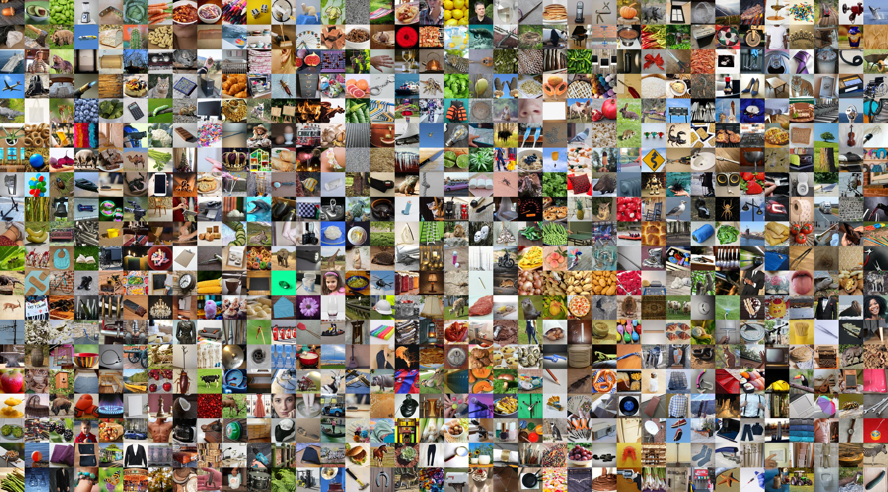

[](https://github.com/courtois-neuromod/cneuromod-things/actions/workflows/deploy.yml)


cneuromod-things
==============================



## Repository overview 

Data, scripts and derivatives for the CNeuroMod-THINGS dataset, for which N=4 CNeuroMod participants (``sub-01``, ``sub-02``, ``sub-03`` and ``sub-06``) underwent 33-36 fMRI sessions of a continuous recognition task based on images from the [THINGS dataset](https://things-initiative.org/).

Files related to the main task are found under ``THINGS``:
- ``THINGS/fmriprep`` includes source and preprocessed BOLD data, eye-tracking data, ``*events.tsv`` files with trialwise metrics (task condition, accuracy, response time), image stimuli and corresponding annotations.
- ``THINGS/tsnr`` includes temporal signal-to-noise maps derived from the BOLD data preprocessed with fmriprep.
- ``THINGS/behaviour`` includes analyses of the subjects' performance on the continuous image recognition task and of fixation compliance during image viewing (assessed with eye-tracking).
- ``THINGS/glmsingle`` includes fMRI analyses and derivatives, including trialwise and imagewise beta scores estimated with GLMsingle, voxelwise noise ceilings, and proof-of-concept analyses to showcase the quality of the data.  
- ``THINGS/glm-memory`` includes GLM-based analyses of memory effects in the preprocessed BOLD data and associated statistical maps.  

In addition, this repository includes data, scripts and derivatives from two complementary vision localizer tasks,
``fLoc`` and ``retinotopy`` (population receptive field), which we used to estimate subject-specific ROIs. The ``anatomical`` data
submodule includes files to visualize voxelwise statistics on flattened cortical surface (a.k.a flat maps).

``datapaper`` includes jupyter notebooks with step-by-step instructions and code to generate figures from data files included in the current repository. These figures include the result figures featured in the following data descriptor pre-print:

**St-Laurent, Marie, Basile Pinsard, Oliver Contier, Elizabeth DuPre, Katja Seeliger, Valentina Borghesani, Julie A. Boyle, Lune Bellec, and Martin N. Hebart.** 2025. “CNeuroMod-THINGS, a Densely-Sampled fMRI Dataset for Visual Neuroscience.” arXiv [q-bio.NC]. [https://doi.org/10.48550/ARXIV.2507.09024](https://arxiv.org/abs/2507.09024).

## Data access

All CNeuroMod data are made available as a [DataLad collection on github](https://github.com/courtois-neuromod/). The released datasets are described [here](https://docs.cneuromod.ca/en/latest/DATASETS.html). DataLad collections can be explored without downloading the data locally, and make it easy to download only the subset of data needed for a project.

The four subjects who contributed to the CNeuroMod-THINGS dataset have requested access to their data, and chosen to share them openly via the [Canadian Open Neuroscience Platform (CONP) data portal](https://portal.conp.ca/dataset?id=projects/cneuromod) as citizen scientists. The data are distributed under a liberal Creative Commons (CC0) data license that authorizes the re-sharing of derivatives, and can be downloaded from the CONP portal without registered access. See our [official documentation](https://docs.cneuromod.ca/en/latest/ACCESS.html#downloading-the-dataset/) for additional information on accessing CNeuroMod datasets.

**1. Installing DataLad**

Install a recent version of the [DataLad software](https://www.datalad.org/),
a tool for versioning large data structures organized in git repositories available
for Linux, OSX and Windows.

If not already present, we also recommend creating an SSH key on the machine
where the dataset will be installed and adding it to Github. See the [official github instructions](https://docs.github.com/en/authentication/connecting-to-github-with-ssh/adding-a-new-ssh-key-to-your-github-account/) on how to create and add a key to your account.


**2. Cloning the cneuromod-things repository**

Install the current repository from GitHub with DataLad. This step only downloads symbolic links used to retrieve the data files (no large files are downloaded).

```bash
datalad clone git@github.com:courtois-neuromod/cneuromod-things.git
```
A warning message will be thrown because the remote origin does not have git-annex installed. This issue will not prevent the installation.

**3. Downloading data files**

You can download specific data subsets and files by specifying their path using the ``datalad get`` command. Note that, if you just cloned the ``cneuromod-things`` repository, its submodules will appear empty. To download a specific data subset, you can navigate to the submodule whose content you need and pull the files directly from there. Use the ``datalad get`` command once to download the submodule’s symbolic links and files stored directly on GitHub, and then a second time to pull files from the remote CONP server. 

For example, you can download ``sub-01``'s files from the THINGS/behaviour submodule with:
```bash
cd cneuromod-things/THINGS/behaviour
datalad get *
datalad get sub-01/beh/*
```

**Warning**: while it is technically feasible to pull the entire content of all nested submodules recursively from the CONP server (using ``datalad get -r *``), we strongly recommend against it due to the complexity and depth of the nested repository structure and sheer dataset size.


Project Organization
------------

    ├── LICENSE
    ├── README.md          <- The top-level README for this repository.
    ├── anatomical         <- Anatomical datasets and scripts
    │    ├── README.md          <- Anatomical dataset overview, links to flat map instructions
    │    ├── smriprep           <- smriprep anatomical output
    │    │      ├── sub-0*         
    │    │      │    └── anat   
    │    │      │         └── sub-0*_label-GM_probseg.nii.gz   <- fmriprep grey matter mask  
    │    │      └── sourcedata         
    │    │            └── freesurfer       <- freesurfer output
    │    │                   ├── doc         
    │    │                   │    └── flatmaps.md   <- Instructions to generate flat maps in pycortex
    │    │                   └── sub-0*    
    │    │                        └── surf   
    │    │                              ├── {lh, rh}.full.patch.3d        <- patches to create flat maps       
    │    │                              ├── {lh, rh}.full.flat.patch.3d      
    │    │                              └── {lh, rh}.full.flat.patch.3d.out       
    │    └── pycortex
    │          ├── README.md
    │          ├── doc
    │          │    └── using_flatmaps.md      <- Instructions to generate flat maps in pycortex
    │          └── db     <- database of pycortex files with annotated surfaces that delineate visual ROIs
    │               └── sub-0*
    │                     ├── anatomicals
    │                     ├── surfaces
    │                     ├── transforms    
    │                     └── overlays.svg  <- annotated with manually traced ROIs for sub-01, 02 and 03
    │
    ├── fLoc                  <- fLoc visual localizer dataset and scripts
    │    ├── README.md        <- Overview of fLoc dataset and scripts
    │    ├── fmriprep         <- fmriprep output
    │    │    ├── sub-0*
    │    │    │     └── ses-*
    │    │    │          └── func    <- preprocessed fMRI files in T1w, MNI152NLin2009cAsym and fsLR space
    │    │    │               ├── sub-0*_ses-0*_task-fLoc_run-*_space-T1w_desc-preproc_part-mag_bold.nii.gz
    │    │    │               ├── sub-0*_ses-0*_task-fLoc_run-*_space-MNI152NLin2009cAsym_desc-preproc_part-mag_bold.nii.gz
    │    │    │               ├── sub-0*_ses-0*_task-fLoc_run-*_space-fsLR_den-91k_part-mag_bold.dtseries.nii   
    │    │    │               └── sub-0*_ses-0*_task-fLoc_run-*_desc-confounds_part-mag_timeseries.tsv  <- noise confounds
    │    │    │  
    │    │    └── sourcedata     <- raw files
    │    │         └── floc      <- bidsified raw fMRI data & output   
    │    │               ├── sub-0*
    │    │               │     └── ses-*
    │    │               │          └── func
    │    │               │               └── sub-0*_ses-00*_task-fLoc_run-0*_events.tsv  <- events.tsv files
    │    │               │
    │    │               └── stimuli     <- stimulus images per category
    │    │  
    │    ├── tsnr         <- temporal signal-to-noise maps 
    │    │    └── sub-0*
    │    │          ├── sub-0*_task-floc_space-MNI152NLin2009cAsym_stat-avgtsnr_statmap.nii.gz   <- tsnr averaged across runs
    │    │          ├── sub-0*_task-floc_space-T1w_stat-avgtsnr_statmap.nii.gz                   <- tsnr averaged across runs
    │    │          └── ses-*
    │    │               └── func  
    │    │                    ├── sub-0*_ses-0*_task-fLoc_run-*_space-MNI152NLin2009cAsym_stat-{mean, stdev, tsnr}_statmap.nii.gz 
    │    │                    └── sub-0*_ses-0*_task-fLoc_run-*_space-T1w_stat-{mean, stdev, tsnr}_statmap.nii.gz
    │    │
    │    └── rois               <- fLoc derivative datasets and scripts
    │            ├── code       <- scripts to run glm and generate ROIs
    │            │     ├── README.md    
    │            │     ├── requirements.txt          
    │            │     ├── fLoc_makedesign.py
    │            │     ├── fLoc_firstLevel_nilearn.py  
    │            │     ├── fLoc_split_CVSparcels_perROI.py  
    │            │     ├── fLoc_reconcile_parcelMasks.py  
    │            │     └── fLoc_reconcile_ROImasks.py
    │            │
    │            ├── standard_masks
    │            │     ├── kanwisher_parcels
    │            │     │    ├── cvs    <- downloaded and unzipped cvs_*_parcels.zip files from https://web.mit.edu/bcs/nklab/GSS.shtml#download
    │            │     │    │    ├── cvs_body_parcels
    │            │     │    │    ├── cvs_face_parcels
    │            │     │    │    ├── cvs_object_parcels
    │            │     │    │    ├── cvs_scene_parcels
    │            │     │    │    └── readme.txt            
    │            │     │    └── mni            
    │            │     │         └── parcel-kanwisher_space-MNI152T1_res-2mm_contrast-{body, face, object, scene}_pseg.nii.gz
    │            │     └── standard_rois  <- unilateral and bilateral ROI masks in CVS and MNI space
    │            │          ├── parcel-kanwisher_space-CVSavg35_contrast-face_roi-{FFA, OFA, pSTS}_desc-{L, R, bilat}_mask.nii.gz
    │            │          ├── parcel-kanwisher_space-MNI152T1_contrast-face_roi-{FFA, OFA, pSTS}_desc-{L, R, bilat}_pseg.nii.gz
    │            │          ├── parcel-kanwisher_space-CVSavg35_contrast-scene_roi-{PPA, OPA, MPA}_desc-{L, R, bilat}_mask.nii.gz
    │            │          ├── parcel-kanwisher_space-MNI152T1_contrast-scene_roi-{PPA, OPA, MPA}_desc-{L, R, bilat}_pseg.nii.gz    
    │            │          ├── parcel-kanwisher_space-CVSavg35_contrast-body_roi-EBA_desc-{L, R, bilat}_mask.nii.gz
    │            │          └── parcel-kanwisher_space-MNI152T1_contrast-body_roi-EBA_desc-{L, R, bilat}_pseg.nii.gz
    │            │
    │            └── sub-0*
    │                  ├── glm               <- first-level GLM contrast on fLoc BOLD data
    │                  │    ├── sub-*_task-floc_model-GLM_design.h5
    │                  │    ├── sub-*_task-floc_space-T1w_label-brain_desc-unionNonNaN_mask.nii.gz
    │                  │    ├── sub-*_task-floc_space-T1w_label-brain_desc-unionNaN_mask.nii.gz
    │                  │    ├── sub-*_task-floc_space-T1w_model-GLM_stat-{betas, tscores}_contrast-*_desc-smooth_statmap.nii.gz    
    │                  │    └── sub-*_task-floc_space-T1w_model-GLM_stat-{betas, tscores}_contrast-*_desc-unsmooth_statmap.nii.gz
    │                  └── rois
    │                       ├── from_atlas       <- Kanwisher parcels and ROI masks warped to subject space
    │                       │     ├── sub-*_parcel-kanwisher_space-T1w_res-anat_contrast-{body, face, object, scene}_pseg.nii.gz    
    │                       │     ├── sub-*_parcel-kanwisher_space-T1w_res-anat_contrast-face_roi-{FFA, OFA, pSTS}_desc-{L, R, bilat}_pseg.nii.gz   
    │                       │     ├── sub-*_parcel-kanwisher_space-T1w_res-anat_contrast-scene_roi-{PPA, OPA, MPA}_desc-{L, R, bilat}_pseg.nii.gz
    │                       │     ├── sub-*_parcel-kanwisher_space-T1w_res-anat_contrast-body_roi-EBA_desc-{L, R, bilat}_pseg.nii.gz
    │                       │     ├── sub-*_parcel-kanwisher_space-T1w_res-func_contrast-{body, face, object, scene}_mask.nii.gz    
    │                       │     ├── sub-*_parcel-kanwisher_space-T1w_res-func_contrast-face_roi-{FFA, OFA, pSTS}_desc-{L, R, bilat}_mask.nii.gz   
    │                       │     ├── sub-*_parcel-kanwisher_space-T1w_res-func_contrast-scene_roi-{PPA, OPA, MPA}_desc-{L, R, bilat}_mask.nii.gz
    │                       │     └── sub-*_parcel-kanwisher_space-T1w_res-func_contrast-body_roi-EBA_desc-{L, R, bilat}_mask.nii.gz
    │                       └── task-derived     <- parcels and ROI masks derived from the fLoc task
    │                             ├── sub-*_task-floc_space-T1w_stat-tscores_contrast-*_cutoff-*_desc-smooth_mask.nii.gz    
    │                             ├── sub-*_task-floc_space-T1w_stat-tscores_contrast-*_cutoff-*_desc-unsmooth_mask.nii.gz
    │                             ├── sub-*_task-floc_space-T1w_stat-tscores_contrast-*_roi-*_cutoff-*_nvox-*_fwhm-*_ratio-*_desc-smooth_mask.nii.gz
    │                             └── sub-*_task-floc_space-T1w_stat-tscores_contrast-*_roi-*_cutoff-*_nvox-*_fwhm-*_ratio-*_desc-unsmooth_mask.nii.gz
    │
    ├── retinotopy              <- retinotopy (pRF) visual localizer datasets and scripts
    │    ├── README.md          <- Overview of retinotopy dataset and scripts
    │    ├── fmriprep           <- retinotopy fmriprep output
    │    │    ├── sub-0*
    │    │    │     └── ses-*
    │    │    │          └── func    <- preprocessed fMRI files in T1w, MNI152NLin2009cAsym and fsLR space
    │    │    │               ├── sub-0*_ses-0*_task-{bars, rings, wedges}_space-T1w_desc-preproc_part-mag_bold.nii.gz
    │    │    │               ├── sub-0*_ses-0*_task-{bars, rings, wedges}_space-MNI152NLin2009cAsym_desc-preproc_part-mag_bold.nii.gz
    │    │    │               ├── sub-0*_ses-0*_task-{bars, rings, wedges}_space-fsLR_den-91k_part-mag_bold.dtseries.nii    
    │    │    │               └── sub-0*_ses-0*_task-{bars, rings, wedges}_desc-confounds_timeseries.tsv  <- noise confounds
    │    │    │  
    │    │    └── sourcedata         <- raw files
    │    │         └── retinotopy    <- bidsified raw fMRI data & output   
    │    │               ├── sub-0*
    │    │               │     └── ses-*
    │    │               │          └── func
    │    │               │               └── sub-0*_ses-*_task-{bars, rings, wedges}_events.tsv  <- events.tsv files
    │    │               └── stimuli
    │    │                     ├── {grid, images, scenes}.npz
    │    │                     └── apertures_{bars, ring, wedge_newtr}.npz
    │    │
    │    ├── tsnr         <- temporal signal-to-noise maps 
    │    │    └── sub-0*
    │    │          ├── sub-0*_task-retinotopy_space-MNI152NLin2009cAsym_stat-avgtsnr_statmap.nii.gz   <- tsnr averaged across runs
    │    │          ├── sub-0*_task-retinotopy_space-T1w_stat-avgtsnr_statmap.nii.gz                   <- tsnr averaged across runs
    │    │          └── ses-*
    │    │               └── func  
    │    │                    ├── sub-0*_ses-0*_task-{bars, rings, wedges}_space-MNI152NLin2009cAsym_stat-{mean, stdev, tsnr}_statmap.nii.gz 
    │    │                    └── sub-0*_ses-0*_task-{bars, rings, wedges}_space-T1w_stat-{mean, stdev, tsnr}_statmap.nii.gz
    │    │
    │    └── prf                  <- population receptive fiels scripts and derivatives (e.g., visual ROIs)
    │         ├── code            <- scripts to run glm single and process output
    │         │     ├── README.md    
    │         │     ├── requirements.txt          
    │         │     ├── analyzePRF   <- analyzePRF repo submodule (a3ac908)  
    │         │     ├── retino_make_apertureMasks.py
    │         │     ├── retino_prepare_BOLD.py
    │         │     ├── retino_run_analyzePRF.m
    │         │     ├── retino_reassamble_voxels.py
    │         │     └── retino_resample_npythy.py
    │         │
    │         ├── apertures       <- aperture masks that delineate task field of view
    │         │     ├── task-retinotopy_condition-bars_desc-perTR_apertures.mat
    │         │     ├── task-retinotopy_condition-rings_desc-perTR_apertures.mat
    │         │     └── task-retinotopy_condition-wedges_desc-perTR_apertures.mat
    │         │
    │         └── sub-0*
    │               ├── prf       <- population receptive fields input and output files
    │               │    ├── input
    │               │    │     ├── sub-0*_task-retinotopy_space-T1w_label-brain_desc-unionNaN_mask.nii    
    │               │    │     ├── sub-0*_task-retinotopy_space-T1w_label-brain_desc-unionNonNaN_mask.nii    
    │               │    │     └── chunks    
    │               │    │            ├── sub-0*_task-retinotopy_condition-bars_space-T1w_desc-chunk{chunk_num}_bold.mat
    │               │    │            ├── sub-0*_task-retinotopy_condition-rings_space-T1w_desc-chunk{chunk_num}_bold.mat    
    │               │    │            └── sub-0*_task-retinotopy_condition-wedges_space-T1w_desc-chunk{chunk_num}_bold.mat
    │               │    └── output
    │               │          ├── sub-0*_task-retinotopy_space-T1w_model-analyzepRF_label-brain_stat-{stat}_statmap.nii.gz
    │               │          ├── sub-0*_task-retinotopy_space-T1w_model-analyzePRF_label-brain_stat-{stat}_desc-npythy_statmap.nii.gz
    │               │          └── chunks    
    │               │                 ├── sub-*_task-retinotopy_space-T1w_model-analyzePRF_stat-ang_desc-chunk{chunk_num}_statseries.mat
    │               │                 ├── sub-*_task-retinotopy_space-T1w_model-analyzePRF_stat-ecc_desc-chunk{chunk_num}_statseries.mat   
    │               │                 ├── sub-0*_task-retinotopy_space-T1w_model-analyzePRF_stat-rfsize_desc-chunk{chunk_num}_statseries.mat
    │               │                 └── sub-0*_task-retinotopy_space-T1w_model-analyzePRF_stat-R2_desc-chunk{chunk_num}_statseries.mat
    │               ├── npythy       <- NeuroPythy toolbox input and output files
    │               │    ├── input
    │               │    │     ├── lh.s*_prf_{ang, ecc, x, y, R2, rfsize}.mgz      
    │               │    │     └── rh.s*_prf_{ang, ecc, x, y, R2, rfsize}.mgz
    │               │    └── output
    │               │          ├── inferred_{angle, eccen, sigma, varea}.mgz
    │               │          ├── {lh, rh}.inferred_{angle, eccen, sigma, varea}.mgz
    │               │          ├── {lh, rh}.retinotopy.sphere.reg
    │               │          ├── inferred_{angle, eccen, sigma, varea}_fsorient.nii.gz
    │               │          ├── sub-*_task-retinotopy_space-T1w_res-anat_model-npythy_atlas-varea_dseg.nii.gz   
    │               │          ├── sub-*_task-retinotopy_space-T1w_res-anat_model-npythy_stat-{angle, eccen, sigma}_statmap.nii.gz           
    │               │          ├── sub-*_task-retinotopy_space-T1w_res-func_model-npythy_atlas-varea_dseg.nii.gz    
    │               │          └── sub-*_task-retinotopy_space-T1w_res-func_model-npythy_stat-{angle, eccen, sigma}_statmap.nii.gz
    │               └── rois       <- visual ROI masks    
    │                    ├── sub-*_task-retinotopy_space-T1w_res-anat_model-npythy_label-{roi}_mask.nii.gz
    │                    ├── sub-*_task-retinotopy_space-T1w_res-func_model-npythy_label-{roi}_desc-nn_mask.nii.gz
    │                    └── sub-*_task-retinotopy_space-T1w_res-func_model-npythy_label-{roi}_desc-linear_mask.nii.gz
    │
    ├── THINGS                    <- THINGS datasets, scripts and derivatives
    │    ├── README.md            <- Overview of THINGS datasets and scripts
    │    ├── fmriprep      <- fmriprep output
    │    │    ├── sub-0*
    │    │    │     └── ses-*
    │    │    │          └── func    <- preprocessed fMRI files in T1w, MNI152NLin2009cAsym and fsLR space
    │    │    │               ├── sub-0*_ses-*_task-things_run-*_part-mag_space-T1w_desc-preproc_bold.nii.gz
    │    │    │               ├── sub-0*_ses-*_task-things_run-*_part-mag_space-T1w_desc-brain_mask.nii.gz    
    │    │    │               ├── sub-0*_ses-*_task-things_run-*_part-mag_space-MNI152NLin2009cAsym_desc-preproc_bold.nii.gz
    │    │    │               ├── sub-0*_ses-*_task-things_run-*_part-mag_space-MNI152NLin2009cAsym_desc-brain_mask.nii.gz
    │    │    │               ├── sub-0*_ses-*_task-things_run-*_part-mag_space-fsLR_den-91k_bold.dtseries.nii
    │    │    │               └── sub-0*_ses-*_task-things_run-*_part-mag_desc-confounds_timeseries.tsv    <- noise confounds
    │    │    │  
    │    │    └── sourcedata      <- raw files
    │    │         └── things     <- bidsified raw fMRI data & output   
    │    │               ├── sub-0*
    │    │               │     └── ses-*
    │    │               │          └── func
    │    │               │               ├── sub-0*_ses-*_task-things_run-*_eyetrack.tsv.gz  <- eye-tracking files
    │    │               │               └── sub-0*_ses-*_task-things_run-*_events.tsv  <- events.tsv files
    │    │               ├── stimuli
    │    │               │     ├── README.md   <- instructions to access stimulus images
    │    │               │     ├── images_fmri <- stimulus images per category (unzip images_fmri.zip here)
    │    │               │     └── annotations <- image annotations
    │    │               │            ├── README.md    <- annotation doc, links to download THINGS+ ratings
    │    │               │            ├── THINGSplus      <- download annotations directly from THINGS+ database
    │    │               │            │     ├── arousal_meanRatings.tsv
    │    │               │            │     ├── category53_wideFormat.tsv
    │    │               │            │     ├── imageLabeling_imageWise.tsv  
    │    │               │            │     ├── imageLabeling_objectWise.tsv
    │    │               │            │     ├── objectProperties_meanRatings.tsv  
    │    │               │            │     ├── size_meanRatings.tsv    
    │    │               │            │     └── things_concepts.tsv   
    │    │               │            ├── task-things_desc-manual_annotation.json
    │    │               │            └── task-things_desc-manual_annotation.tsv
    │    │               ├── code
    │    │               │     ├── README.md
    │    │               │     ├── cleanup             <- scripts to validate events.tsv files    
    │    │               │     │      ├── requirements.txt       
    │    │               │     │      ├── qc_notes.md          <- notes on QCing runs & sessions        
    │    │               │     │      ├── clean_events.py      <- script to relabel/clean *events.tsv files
    │    │               │     │      └── add_lastKP.py        <- script to derive performance metrics from last keypress    
    │    │               │     └── eyetracking         <- scripts to process eye-tracking data
    │    │               │            ├── requirements.txt    
    │    │               │            ├── step1_eyetrack_prep.py      <- exports raw gaze to numpy, plots qc charts        
    │    │               │            ├── step2_eyetrack_prep.py      <- drift corrects, exports gaze and fixation metrics
    │    │               │            ├── step3_reconcile_events.py   <- add fixation metrics to events files
    │    │               │            └── utils.py                    <- support functions
    │    │               │    
    │    │               └── task-things_events.json       <- defines columns in events.tsv files
    │    │
    │    ├── tsnr         <- temporal signal-to-noise maps 
    │    │    └── sub-0*
    │    │          ├── sub-0*_task-things_space-MNI152NLin2009cAsym_stat-avgtsnr_statmap.nii.gz   <- tsnr averaged across runs
    │    │          ├── sub-0*_task-things_space-T1w_stat-avgtsnr_statmap.nii.gz                   <- tsnr averaged across runs
    │    │          └── ses-*
    │    │               └── func  
    │    │                    ├── sub-0*_ses-*_task-things_run-*_space-MNI152NLin2009cAsym_stat-{mean, stdev, tsnr}_statmap.nii.gz 
    │    │                    └── sub-0*_ses-*_task-things_run-*_space-T1w_stat-{mean, stdev, tsnr}_statmap.nii.gz
    │    │
    │    ├── behaviour        <- performance on the image recognition task & fixation compliance
    │    │       ├── README.md
    │    │       ├── code
    │    │       │     ├── requirements.txt
    │    │       │     ├── analyze_fixations.py        <- processes trial-wise fixations
    │    │       │     ├── behav_data_annotate.py      <- builds trial-wise image annotations   
    │    │       │     └── behav_data_memoperformance.py       <- computes memory scores from events.tsv files
    │    │       ├── sub-0*
    │    │       │     ├── fix
    │    │       │     │    ├── sub-0*_task-things_desc-fixCompliance_statseries.tsv
    │    │       │     │    └── sub-0*_task-things_desc-driftCor_gaze.tsv
    │    │       │     └── beh
    │    │       │          ├── sub-0*_task-things_desc-perTrial_annotation.tsv      
    │    │       │          ├── sub-0*_task-things_catNum.tsv  
    │    │       │          ├── sub-0*_task-things_imgNum.tsv  
    │    │       │          ├── sub-0*_task-things_desc-perTrial_beh.tsv    
    │    │       │          ├── sub-0*_task-things_desc-perRun_beh.tsv    
    │    │       │          ├── sub-0*_task-things_desc-perSession_beh.tsv    
    │    │       │          └── sub-0*_task-things_desc-global_beh.tsv    
    │    │       ├── task-things_desc-perTrial_annotation.json
    │    │       ├── task-things_desc-fixCompliance_statseries.json    
    │    │       └── task-things_beh.json
    │    │
    │    ├── glmsingle        <- GLMsingle derivatives (voxel-wise betas, noise ceilings)
    │    |       ├── code            <- scripts to run GLMsingle and process output
    │    |       │     ├── requirements.txt      
    │    |       │     ├── qc
    │    |       │     │    ├── README.md               
    │    |       │     │    └── compile_headmotion.py   
    │    |       │     ├── glmsingle       
    │    |       │     │    ├── GLMsingle  <- GLMsingle repo submodule (c4e298e)    
    │    |       │     │    ├── README.md       
    │    |       │     │    ├── GLMsingle_makedesign.py                   
    │    |       │     │    ├── GLMsingle_preprocBOLD.py
    │    |       │     │    ├── GLMsingle_makerunlist.py  
    │    |       │     │    ├── GLMsingle_cleanmask.py  
    │    |       │     │    ├── GLMsingle_run.m    
    │    |       │     │    ├── GLMsingle_noiseceilings.py          
    │    |       │     │    ├── GLMsingle_betasPerTrial.py  
    │    |       │     │    └── GLMsingle_betasPerImg.py
    │    |       │     └── descriptive    
    │    |       │          ├── README.md         
    │    |       │          ├── extract_annotations.py  
    │    |       │          ├── rank_img_perVox.py  
    │    |       │          └── beta_scaling.py        
    │    |       │
    │    |       ├── task-things_runlist.h5             <- list of valid runs per subject
    │    |       ├── task-things_imgAnnotations.json    <- dictionary of compiled image annotations
    │    |       │
    │    |       └── sub-0*
    │    |             ├── glmsingle  <- GLMsingle input and output (voxelwise betas, noise ceilings)
    │    |             │    ├── input    
    │    |             │    │     ├── sub-*_task-things_model-glmsingle_desc-sparse_design.h5
    │    |             │    │     ├── sub-*_task-things_imgDesignNumbers.json
    │    |             │    │     ├── sub-*_task-things_space-T1w_maskedBOLD.h5     
    │    |             │    │     ├── sub-*_task-things_space-T1w_label-brain_desc-union_mask.nii
    │    |             │    │     ├── sub-*_task-things_space-T1w_label-brain_desc-unionNonNaN_mask.nii
    │    |             │    │     ├── sub-*_task-things_space-T1w_label-brain_desc-unionNaN_mask.nii
    │    |             │    │     └── ...    
    │    |             │    └── output    
    │    |             │          ├── T1w
    │    |             │          │     ├── TYPEA_ONOFF.mat    
    │    |             │          │     ├── TYPEB_FITHRF.mat   
    │    |             │          │     ├── TYPEC_FITHRF_GLMDENOISE.mat
    │    |             │          │     └── TYPED_FITHRF_GLMDENOISE_RR.mat  
    │    |             │          ├── sub-0*_task-things_space-T1w_model-fitHrfGLMdenoiseRR_stat-imageBetas_desc-zscore_statseries.h5  
    │    |             │          ├── sub-0*_task-things_space-T1w_model-fitHrfGLMdenoiseRR_stat-trialBetas_desc-zscore_statseries.h5      
    │    |             │          └── sub-0*_task-things_space-T1w_model-fitHrfGLMdenoiseRR_stat-noiseCeilings_statmap.nii.gz
    │    |             │
    │    |             ├── qc     <- quality checks
    │    |             │    └── sub-0*_task-things_headmotion.tsv
    │    |             └── descriptive   <- annotated beta rankings and t-SNE plots per visual ROIs
    │    |                  ├── sub-*_task-things_desc-{perImage, perTrial}_labels.npy
    │    |                  ├── sub-*_task-things_space-T1w_stat-{betas, ranks}_desc-{perImage, perTrial}_statseries.npy
    │    |                  ├── sub-*_task-things_space-T1w_contrast-*_roi-*_cutoff-*_nvox-*_stat-{ranks, betas, noiceCeilings}_desc-{perImage, perTrial}_statseries.npy  
    │    |                  └── sub-*_task-things_space-T1w_stat-tSNE_label-visualROIs_desc-{perImage, perTrial}_statseries.npz
    │    │    
    │    └── glm-memory        <- analyses of memory effects in the preprocessed BOLD data
    │            ├── README.md
    │            ├── LICENSE.md
    │            ├── code
    │            │     ├── requirements.txt
    │            │     ├── check-memory-counts.py        <- check the distribution of each memory condition across BOLD runs
    │            │     ├── glm_mem_betas.py              <- t-tests contrasting GLMsingle betas across memory conditions
    │            │     └── gen-memory-ffx.py             <- subject-level fixed effects analysis of memory contrasts
    │            └── sub-0*
    │                  └── glm
    │                       │── sub-0*_task-things_space-T1w_contrast-HitvCorrectRej_stat-{t, p}_desc-fromBetas_statmap.nii.gz   
    │                       │── sub-0*_task-things_space-T1w_contrast-Hit{Within, Btwn}vCorrectRej_stat-{t, p}_desc-fromBetas_statmap.nii.gz   
    │                       │── sub-0*_task-things_space-T1w_contrast-HitvCorrectRej_stat-{effect, t, variance, z}_desc-fromBOLD_statmap.nii.gz   
    │                       └── sub-0*_task-things_space-T1w_contrast-Hit{Within, Btwn}vCorrectRej_stat-{effect, t, variance, z}_desc-fromBOLD_statmap.nii.gz   
    │
    └── datapaper          <- Report, figures, visualization notebooks
        ├── figures        <- Graphics and figures from the report
        ├── notebooks      <- Code to generate datapaper figures
        │       ├── behav_analysis.ipynb            <- behav figures     
        │       ├── annotated_betas_per_ROI.ipynb   <- top betas per ROI figures          
        │       ├── beta_dimReduction.ipynb         <- beta t-SNE plots    
        │       ├── fixation_compliance.ipynb       <- gaze position distribution  
        │       ├── brain_flatmaps.ipynb            <- noise ceilings, TSNR and t-scores projected on cortical flat maps    
        │       └── qc_motion_response.ipynb        <- response rates and framewise displacement figs  
        └── report         <- Data paper manuscript     <- TODO

--------
